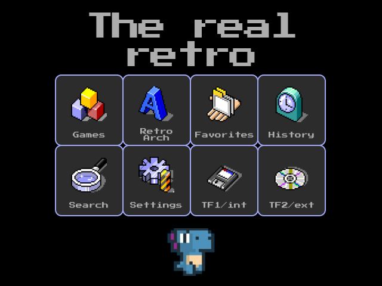

# Anbernic RG35XX Plus — Apps

A collection of open-source apps for the **Anbernic RG35XX Plus** stock firmware (OFW).

> Compatible with official firmware versions [1.1.5 - 1.2.3](https://win.anbernic.com/download/318.html)

---

## Installation

All apps follow the same installation pattern:

1. Place the app directory contents into `Roms/APPS` on the internal (TF1) or external (TF2) SD card
2. Launch from the Anbernic app menu

---

## Apps

### 🚀 System Booster

The RG35XX Plus OFW ships with a misconfigured timezone, broken package repositories, unnecessary background services draining CPU and battery, and an undersized userdata partition. System Booster addresses all of it in a single run - no terminal, no manual steps. Previously known as [Enhancement Patch](https://github.com/exdial/anbernic-apps/tree/master/Enhancment-Patch/README.md). Safe to run multiple times - it only applies changes that have not been made yet, and never overwrites existing backups.

**[→ System Booster](https://github.com/exdial/anbernic-apps/tree/master/SystemBooster/README.md)**

---

### 🔑 SSH Enabler

Enables the SSH server on the device. Default credentials: `root` / `root`.

Requires an active Wi-Fi connection.

**[→ SSH Enabler](https://github.com/exdial/anbernic-apps/tree/master/SSH-Enabler)**

---

### 🎨 The Real Retro Theme

Replaces the stock UI icons, loading screens, and wallpapers with a custom retro aesthetic.

**[→ The Real Retro Theme](https://github.com/exdial/anbernic-apps/tree/master/TheRealRetro-Theme)**

---

## Feedback

[Suggestions and improvements](https://github.com/exdial/anbernic-apps/issues)
